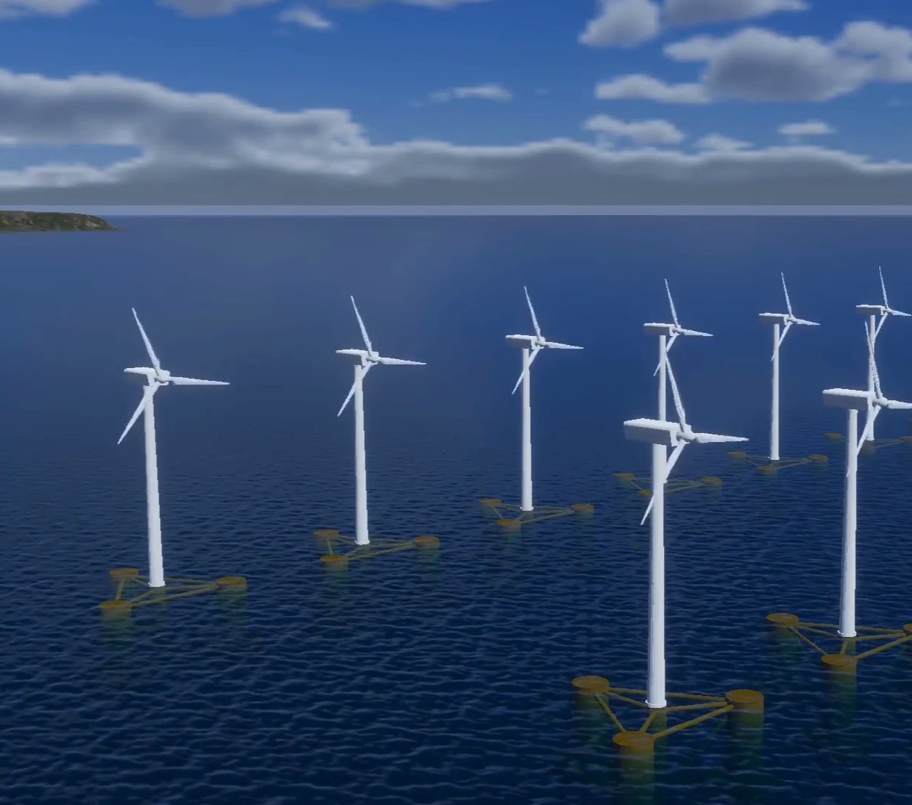
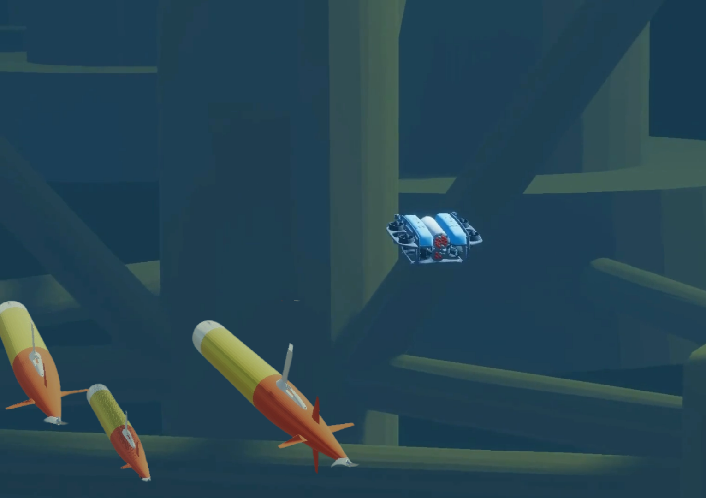
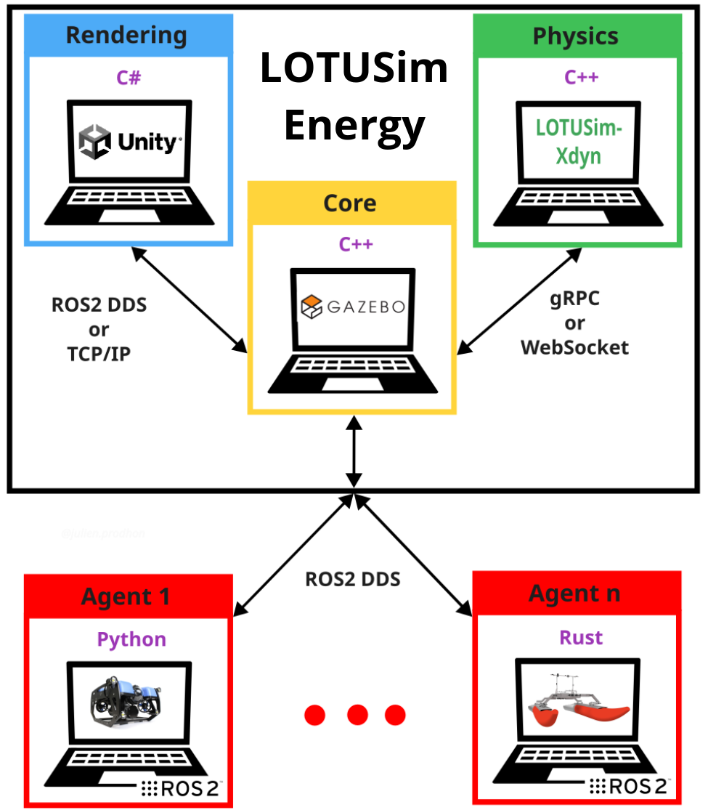

# LOTUSim-Energy

LOTUSim-Energy leverages the core simulation framework (https://github.com/naval-group/LOTUSim) and physics interface (https://github.com/naval-group/LOTUSim-Xdyn) provided by these repositories.

<div style="display: flex; gap: 10px; align-items: flex-start;">
  
  
</div>

## Overview

LOTUSim-Energy is a distributed server-client simulation framework for multi-domain robotics. Gazebo is the central orchestrator for asset management and simulation timing (deterministic step scheduler); separate client modules run the individual simulation tasks.

The core simulation control module interfaces with three primary client modules:

- Physics: LOTUSim-Xdyn as the physics interface
- Agent Interaction: ROS 2 for inter-agent messaging and hardware-in-the-loop bridges
- Rendering: Unity as the optional high-fidelity renderer for human–robot interaction (HRI)



## Table of Contents
- [Requirements / Setup](#requirements--setup)
- [Get Started](#get-started)
- [Start using the Leap Motion](#start-using-the-leap-motion)
- [Start using the Tobbi Eye Tracker 5](#start-using-the-tobbi-eye-tracker-5)
- [Packages / Assets available](#packages--assets-available)
- [Scenes](#scenes)
- [Scripts](#scripts)
- [Executables](#executables)
- [Video](#video)
- [Relevant Publications](#relevant-publications)
- [Appendix](#appendix)


## Requirements / Setup
- **Unity** `2022.3.18f`  
- **Multi-Users** `PUN2 - Photon Unity Networking 2` (already in the git) 
- **Leap Motion** (works on Linux and Windows) An `Ultraleap Hand Tracking Camera` 
You will need a computer that meets the [Tracking Requirements](https://www.ultraleap.com/gemini-downloads/?_gl=1*1p21y34*_ga*MjA3MTg2NzM3NS4xNzQ1ODk1Mjky*_ga_5G8B19JLWG*czE3NTAzOTQ1ODQkbzEwJGcwJHQxNzUwMzk0NTg0JGo2MCRsMCRoMA..) and have the `[Ultraleap Hand Tracking Software (V5.2+)]`(https://www.ultraleap.com/downloads/) installed (for this project, the **Leap Motion Controller** have been used) 
- **Eye Tracker (only on Windows)** `Tobii Eye Tracker 5` device  
Tobii Gaming | Download or Setup Eye Tracking Software and Drivers install the driver
Then Tobii Ghost,
Install the `Tobii Experience App` in the Microsoft Store  
The `Tobii Experience Driver v1.133` (https://gaming.tobii.com/getstarted/?bundle=tobii-et5)  
And the `Tobii Ghost v1.14.1` (https://gaming.tobii.com/getstarted/?bundle=tobii-et5)

---

## Get Started

1. **Get the Unity project**    
Use this command :
```bash
git clone --recurse-submodules https://github.com/naval-group/LOTUSim-Unity-modules
```

And after cloning:
```sh
cd LOTUSim-Unity-modules
git submodule update --remote --merge
```

2. **Add & open the project on Unity Hub.**
3. **Open one of the scenes**
4. **Run the scene.**

## Start using the Leap Motion

1. Make sure you have the [requirements](#requirements/setup) installed for the Leap Motion with the device you have.
2. Plug your Leap Motion and check by using the Leap Motion Software if it is active on your computer.
3. Place the Leap in front of the user, with the **wire pointing left** (the Leap has been implemented to be Desktop mounted)
4. Check that the Unity scene you are using have the GameObject `LeapMouvementController` activated (in Unity).
> Note: Leap Motion input was developed against the `defenseScenario` scene, which is not part of this repository. Using it in an Energy scene requires adding the `LeapMouvementController` GameObject yourself.
5. If you see **red lights** on the cameras of the Leap, it is ready to be used!

## Start using the Tobbi Eye Tracker 5

1. Plug the Eye Tracker, and make sure you have the [requirements](#requirements/setup) installed.
2. Open the `Tobii Experience App` and callibrate your device by following the instructions.
3. Open the `Tobii Ghost` app and play with the settings to display the gaze trace and more...
4. You can start running your simulations and the Eye Tracker will track your gaze!

---

## Packages / Assets available
- `CityPeople`: Unity asset available [here](https://assetstore.unity.com/packages/3d/characters/city-people-free-samples-260446) to have civilians models.
- `HandPoses`: Recorded hand poses for moving through a scene with hand gestures instead of the keyboard. The `defenseScenario` scene they were recorded against is not part of this repository.
- `IslandTools`: Unity tools to build the environment.
- `LowPolySolider_demo`: Unity asset available [here](https://assetstore.unity.com/packages/3d/characters/low-poly-soldiers-demo-73611) to have soldiers models. 
- `Photon`: Photon Unity Networking ([PUN](https://doc.photonengine.com/pun/current/getting-started/pun-intro)), a Unity package for multiplayer applications. Its matchmaking places players in rooms in which objects are synchronised over the network.

---

## Scenes

### Unity Scenes Folder Overview

The Unity project has three main scene folders, each covering a specific set of simulation and interaction features.


### Energy
The `Energy` folder holds this repository's own scenes: `demo_facet`,
`demo_facet_VR`, `empty` and `facet_waypoint_yolo`, alongside the shared
`Launcher` scene at the root of `Assets/Scenes/`. These are the scenes that
pair with the LOTUSim-generic-scenario configs of the same names.

### LeapMotion
The `LeapMotion` folder holds scenes and assets that record and interpret hand
poses to control camera movement, in place of keyboard controls. Launch the
scene and follow the on-screen instructions to calibrate and test hand input.

### MultiUser
The `MultiUser` folder contains the scenes for multi-user operation. Its
launcher scene spawns a configurable Kyle robot (edited in the `Kyle` scene)
and enters a shared two-player environment, with state synchronised between
the users.

---

## Scripts

The project is organized into several script folders, each handling a specific aspect of the simulation and interaction system.
Scripts sitting directly in `Scripts` cover the scene environment itself: endless seabed and water plane, storm state, wind particles, key bindings and the inspection detector.
The `Camera` folder contains scripts for managing and switching between different camera views across scenes.
The folder `EditorEnvironment` manages real-time simulation parameters, including the display of the Real-Time Factor, computation of the FPS, and interactive controls like the wind slider. It also holds the HUD panels and the wind, wind-region and ocean-current visualizations, and scripts that control environmental elements such as the sun and clouds.
The `waypoint` folder drives agents along routes and draws their trajectories.
The `lotusim_interface` folder connects Unity to the simulation, over ROS 2 or TCP/IP.
The `Editor` folder holds editor-only tooling, reachable from the `LOTUSim` menu.
The `LeapMotion` folder handles hand-tracking interactions.
The `MultiUser` folder enables multi-user connectivity and synchronization.
The `XR-Controller` folder provides VR support, handling user input and interaction.


#### Camera:
- `CameraDynamicTargetsNavigator.cs` : Dynamically navigates the camera between scene objects by smoothly moving, rotating, and zooming. Supports arrow key navigation (← →) to cycle through targets.
- `CameraKnownTargetsNavigator.cs` :  Handles smooth navigation between a predefined list of known scene targets.
    - Moves the camera smoothly toward each target using configurable offsets.
    - Performs smooth rotation to face each target.
    - Smoothly adjusts the camera's field of view (zoom) per target.
    - Navigation between targets is controlled using the Left and Right arrow keys.
- `CameraManager.cs` :  Manages switching between multiple sets of Cinemachine virtual cameras in a scene.
    - Each set (Front, Right, Left) represents a different viewpoint of the same scene target.
     - Uses arrow key input to cycle through targets.
- `CameraModeSwitcher.cs` : Switches between automatic target-following camera mode and free-fly spectator mode.
     - Arrow keys (↑ ↓ ← →) enable Auto mode (entity navigation).
     - Q, W, E, A, S, D keys enable Free-Fly mode (manual movement).
- `CameraSensor.cs`:  Publishes RGB camera frames from Unity to ROS via the ROS–TCP Connector. Designed for integration with Unity Robotics Hub and Lotusim's simulation framework.
- `DynamicObjectNameDisplay.cs` : Dynamically displays the names of objects above them in the scene. Allows the user to toggle the visibility of these labels using a designated key.
- `FPSLimiter.cs` : Controls the application's target frame rate to ensure consistent performance.
- `FreeFlyCamera.cs` : Controls the camera for a free fly spectator. Camera movement by 'W','A','S','D','Q','E' and speed of the quick camera movement when holding the 'Left Shift' key.
- `DisplaySwitcher.cs` : Routes one camera at a time to the primary display and parks the others off-screen, so views do not overlap on a single monitor. Static cameras are wired in the Inspector; agent cameras are resolved at runtime by fleet name.
- `DroneCameraHUD.cs` : Screen-space overlay attached to each drone camera, grouped by drone type (x500 / wamv / bluerov). [↑ ↓] cycle through the drones of a fleet. The overlay layer is excluded from the frames sent to the detection server.
- `ObjectNameDisplay.cs` : Displays a fixed, Inspector-configured list of labels above their target objects, toggled with a designated key.

#### MultiUser:
- `CameraWork.cs` : Follows the player with the camera.
- `GameManager.cs` : Handles the session, instantiating players and cameras according to the connected user.
- `Launcher.cs` : Connects and joins or creates a room automatically, in player or spectator mode.
- `LoaderAnime.cs` : Drives the loading animation shown while connecting.
- `PlayerAnimatorManager.cs` : Drives the networked player's Animator component.
- `PlayerManager.cs` : Handles the networked player instance.
- `PlayerNameInputField.cs` : Takes the name to save as the network player name, shown above each player to everyone in the room.
- `PlayerUI.cs` : Displays the networked player's UI, following the player to show its health and name.
- `SpectatorCamera.cs` : Sets the spectator camera movements.


### EditorEnvironment:
- `AgentSpawner.cs` : Spawns multiple instances of a given model prefab at defined positions, optionally using CLI arguments.
- `common.cs` : Utility for converting ROS/Gazebo coordinate system (right-handed) to Unity (left-handed) coordinate system.
- `EnvironmentControlEditor.cs` : Scripts to control the sun and the rain in a scene.
- `EnvironmentController.cs` : Scripts to control the sun and the rain in a scene.
- `FpsTracker.cs`: Tracks FPS over the last 1000 frames and saves the results to a CSV file on application quit.
- `InfiniteSeabed.cs` : Manages an infinite seabed using a 3x3 grid of tiles around the camera.
- `InputLockManager.cs` :  Handles cursor locking/unlocking and enables or disables camera control accordingly. Useful for toggling between gameplay (mouse locked) and UI interaction (mouse free).
- `LotusimConnectorEditor.cs` : Custom Unity Editor script for LotusimInterface that lets users select and update the interface type and namespace directly in the Inspector, automatically applying changes and triggering relevant callbacks.
- `RTFLabelUpdate.cs` :  Displays the Real-Time Factor (RTF) from the ROS simulation as a percentage on a TMP label. Toggles visibility with the 'L' key.
- `WindSliderController.cs` : Controls wind vector sliders along X, Y, Z axes and publishes their values to a ROS2 topic via TCP/IP.
 Supports keyboard shortcuts for increment/decrement and reset.
- `AgentBatteryHUD.cs` : Battery monitor for dynamically spawned agents. Every object carrying a `RendererPosesWaypointFollower` was spawned by `LotusimConnector`, so no name filtering is needed.
- `HelpMenuHUD.cs` : Builds the in-scene help panel listing the key bindings declared in `KeyBindings.cs`.
- `ImageDisplayHUD.cs` : Shows a still image panel that can be toggled and whose sprite can be swapped at runtime.
- `MaintenanceHUD.cs` : Displays a maintenance overview of the drone fleet, toggled with the 'O' key.
- `DetectionWarningHUD.cs` : Draws a canned detection-uncertainty warning over drone cameras (toggled with 'J'). Not driven by real detection data.
- `WarningHUD.cs` : Draws a canned emergency warning popup (toggled with 'K'). Not driven by real data.
- `OceanCurrentVisualizer.cs` : Renders the ocean current as a grid of arrow `LineRenderer`s below sea level, driven by the current message's `enable_current` flag.
- `WindFieldVisualizer.cs` : Renders the global wind field as a grid of arrow `LineRenderer`s.
- `WindArrowFieldRenderer.cs` : Reusable arrow-grid renderer over a rectangular XZ area sharing one direction and magnitude; arrow length and width scale with magnitude and the colour is supplied by the caller.
- `WindRegionVisualizer.cs` : Renders each entry of a `WindRegionArray` message as a wireframe 3D shape coloured by wind speed, with an arrow field for its wind vector; creates, updates and tears down one zone per region id.
- `WindRegionShapeRenderer.cs` : `IWindRegionShapeRenderer` interface and the shared visual settings every region shape renders with, one implementation per `WindRegion` shape type.
- `BoxShapeRenderer.cs` : `IWindRegionShapeRenderer` implementation for box-shaped wind regions.
- `ConeSegmentShapeRenderer.cs` : `IWindRegionShapeRenderer` implementation for cone-segment wind regions, used for turbine wakes.
- `WindZoneGeometry.cs` : `LineRenderer` construction helpers (open and closed wireframe lines) shared by the wind region shape renderers.
- `WindVisualUtils.cs` : Material helpers configuring HDRP/Unlit for alpha-blended, double-sided rendering, so translucent wind visuals blend instead of clipping their own alpha.
- `WindHUDIndicator.cs` : Pixel-drawn circular wind direction panel in the bottom-left corner, with a rotating arrow and a speed label.
- `WindTurbineController.cs` : Drives a turbine's Animator speed and power output from the effective wind speed, taken either from a ROS 2 wind topic or pushed in by another system.
- `WindPowerGraphHUD.cs` : Records and plots `PowerW` for every wind turbine in the scene, with a manual start/stop/save workflow.
- `WindLcoeGraphHUD.cs` : Subscribes to the world's `lcoe` topic, plots the farm's levelised cost of energy over time, and saves the recording under the user's Downloads directory.


### Scripts (root):
- `InfinitePlane.cs` : Keeps an odd-sized grid of tiling plane chunks centred on the camera, giving an apparently endless surface.
- `SeabedObjects.cs` : Scatters prefabs across the `InfinitePlane` chunks to populate the seabed.
- `InspectionDetector.cs` : Captures frames from a Unity camera, publishes them as `sensor_msgs/CompressedImage`, and draws bounding boxes over the corrosion and crack detections that come back asynchronously as JSON on a separate topic. All ROS I/O goes through `RosInterface`.
- `KeyBindings.cs` : Single declaration of every runtime key binding, annotated with the category and description `HelpMenuHUD` renders.
- `StormController.cs` : Drives sky, fog and ocean parameters from a single storm-intensity value, transitioning smoothly between calm and storm.
- `TurbineFoamRing.cs` : Emits a ring of foam particles at the waterline around a turbine monopile.
- `WindEffect.cs` : Spawns wind particles around the camera, with count, speed and spread scaled by the current wind speed.
- `WindZoneController.cs` : Drives Unity's `WindZone` and the wind particle system from the wind vector, stopping emission below a minimum speed threshold.

### waypoint:
- `RendererPosesWaypointFollower.cs` : Pose follower using snapshot interpolation — it buffers incoming ROS poses and replays them with a small delay, removing the stutter of low-frequency Gazebo updates.
- `BlueROVWaypointFollower.cs` : Inspector-configured route follower for the BlueROV, with model alignment, speed and turning parameters.
- `WamvWaypointFollower.cs` : Same route follower for the WAM-V.
- `X500WaypointFollower.cs` : Same route follower for the X500 drone.
- `TrajectoryDrawer.cs` : Draws an agent's trajectory as a trail, dropping the oldest points to keep the polyline within a length in metres and a hard point cap.
- `UnityPatrolExporter.cs` : Exports a patrol route configured in the Inspector to a JSON file for use by a scenario.

### Editor:
- `CoordinateExporter.cs` : Editor window (LOTUSim / Utilities) exporting selected scene coordinates to JSON.
- `WaypointCapturerWindow.cs` : Editor window (LOTUSim / Utilities) capturing waypoints from the scene view.
- `PerformanceMonitorWindow.cs` : Editor window (LOTUSim / Utilities) showing runtime performance figures.
- `TextureCombiner.cs` : Editor window (LOTUSim / Utilities) packing several textures into one.
- `CorrosionPainterTool.cs` : Editor window (LOTUSim) placing corrosion decals on inspection targets.
- `CrackPainterTool.cs` : Editor window (LOTUSim) placing crack decals on inspection targets.

### LeapMotion:
- `LeapMotionMovement.cs` :  Uses Leap Motion hand pose detection to control a CharacterController in 3D space. Supports movement in six directions: forward, back, left, right, up, and down.


### lotusim_interface:
- `common.cs` : Utility class for converting poses between Gazebo and Unity coordinate systems.
- `InterfaceFactory.cs` : Factory and driver for creating and updating Lotusim interfaces (ROS2, TCPIP, etc.)
- `LotusimBaseInterface.cs` : Base abstract class for all interfaces in the Lotusim system. Interfaces populate pose, creation, destruction, and propeller data for vessels. 
- `LotusimConnector.cs` : Main Unity interface for Lotusim. Wraps LotusimBaseInterface implementations (ROS2, TCPIP). Handles creation, destruction, and updating of vessels, transforms, and animations.
- `ROSConnectionConfigurator.cs` : Reads ROS IP and port from PlayerPrefs and configures the ROSConnection singleton.
- `GazeboCustomCmdInterface.cs` : Minimal TCP listener receiving custom commands from Gazebo on a configurable port, on a background thread.
- `GazeboWaveInterface.cs` : Samples the HDRP water surface height on a configurable XZ grid and writes the sampled positions to a YAML log.


### lotusim_interface/ROS2_interface:
- `RosInterface.cs` :  Singleton interface for ROS2 communication in Lotusim. Handles vessel pose updates, renderer commands, dynamic vessel commands, and simulation stats.
- `RosLogFilter.cs` : `ILogHandler` wrapper filtering noisy ROS-TCP-Connector log output out of the Unity console.


### lotusim_interface/Tcp_interface:
- `TcpIpInterface.cs` :  Handles UDP/TCP communication with external clients for vessel updates and commands. Supports thread-safe data reception and processing, including vessel positions and commands.
- `TCPIPInterfaceTypes.cs` : Contains data structures and JSON converters for vessel info and Unity commands used in TCP/IP communication in Lotusim.


### xr_controller
- `XR Controller.cs` : Handles movement of the XR camera in 3D space based on directional commands.


---


## Executables

Executable for _Linux_ and _Windows_ of **LOTUSim** are available in the `lotusim-generic-scenario` repository.
It includes the Launcher scene already built and ready to run.

Build details and usage instructions are in the README and wiki of the `lotusim-generic-scenario` repository.

>**Note:** If you wish to develop your own scenario or Unity scene, you can integrate it with LOTUSim-core (repo LOTUSim)using the same `lotusim-generic-scenario` framework.  
Before doing so, make sure to **build your Unity scene** for the desired platform and follow the same **linking process** described in the `lotusim-generic-scenario` documentation to connect Unity with LOTUSim.


## Video

A demonstrative video of LOTUSim is available on YouTube:

[](https://www.youtube.com/watch?v=iXDz8ZqSpq4)

## Relevant Publications

If you use [LOTUSim](https://github.com/naval-group/LOTUSim) in your research, or any of the repositories directly linked to LOTUSim
- [LOTUSim-Xdyn](https://github.com/naval-group/LOTUSim-Xdyn),
- [LOTUSim-generic-scenario](https://github.com/naval-group/LOTUSim-generic-scenario),
- [LOTUSim-Unity-modules](https://github.com/naval-group/LOTUSim-Unity-modules),
- [LOTUSim-UI-frontend](https://github.com/naval-group/LOTUSim-UI-frontend),
- [LOTUSim-UI-backend](https://github.com/naval-group/LOTUSim-UI-backend),

Please cite:

```bibtex
@inproceedings{LOTUSim26iros,
  title     = {{LOTUSim}: Multi-Domain Simulator for Marine Robotics},
  author    = {Buche, Cedric and Grosset, Juliette and Lechene, Helene and Dubromel, Marie and Havez-Bodivit, Pierig and Neo, Malcom and Prodhon, Julien},
  booktitle = {2026 IEEE/RSJ International Conference on Intelligent Robots and Systems (IROS)},
  year      = {2026},
  publisher = {IEEE}
}
```

## Appendix

### Hydrodynamic Parameters

Hydrodynamic parameters by agent (LRAUV values from the OSRF LRAUV Tethys model):

| **Param** / **Agent** | **LRAUV** | **BlueROV** |
| ------------------ | --------- | ----------- |
| **Mass $m$ [kg]**  | 147.87    | 10          |
| -------------------- | --------- | ----------- |
| **Added mass**       | **LRAUV** | **BlueROV** |
| $X_{\dot u}$ [kg]    | -4.8762   | 0           |
| $Y_{\dot v}$ [kg]    | -126.3247 | 0           |
| $Z_{\dot w}$ [kg]    | -126.3247 | 0           |
| $M_{\dot q}$ [kg·m²] | -33.4631  | 0           |
| $N_{\dot r}$ [kg·m²] | -33.4931  | 0           |
| $M_{\dot w}$ [kg·m]  | +7.1178   | 0           |
| $N_{\dot v}$ [kg·m]  | -7.1178   | 0           |
| $Y_{\dot r}$ [kg·m]  | -7.1178   | 0           |
| $Z_{\dot q}$ [kg·m]  | +7.1178   | 0           |
| **Sensors** | Sparton AHRS-M2 Magnetometer + IMU + Additional sensors (see Table `lotusim_tasks`) | IMU + Additional sensors (see Table `lotusim_tasks`) |
| ------------------------------- | --------- | ----------- |
| **Linear damping coefficients** | **LRAUV** | **BlueROV** |
| $X_u$ [N·s·m⁻¹]                 | 0         | 11.7391     |
| $Y_v$ [N·s·m⁻¹]                 | 0         | 20          |
| $Z_w$ [N·s·m⁻¹]                 | 0         | 31.87       |
| $K_p$ [N·m·s]                   | 0         | 25          |
| $M_q$ [N·m·s]                   | 0         | 44.91       |
| $N_r$ [N·m·s]                   | 0         | 5           |
| ------------------- | ------- | ------- |
| **Quadratic damping coefficients** | **LRAUV** | **BlueROV**  |
| $X_{\|u\|u}$ [kg·m⁻¹] | —       | 0       |
| $Y_{\|v\|v}$ [kg·m⁻¹] | -601.27 | 0       |
| $Z_{\|w\|w}$ [kg·m⁻¹] | -601.27 | 0       |
| $K_{\|p\|p}$ [kg·m²]  | -0.19   | 0       |
| $M_{\|q\|q}$ [kg·m²]  | -632.7  | 0       |
| $N_{\|r\|r}$ [kg·m²]  | -632.7  | 0       |
